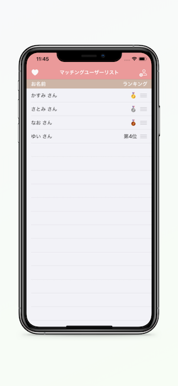

# DatingAppMemo
 
 
# Features
マッチングアプリでマッチしたユーザーひとりひとりの情報をシンプルに管理できます。 
また、ユーザーをランキング形式で並び替えることができます。
 
# Requirement
 
* Swift 5
* Xcode 11.5
* Realm 5.3.1
* RealmSwift 5.3.1
* LicensePlist
 
# Installation
 
CocoaPodsが必要です。  
インストールの上、ディレクトリを移動し下記コマンドを実行してライブラリをインストールしてください。
 
```bash
pod install
```

# App Store

https://apps.apple.com/app/id1525171788
